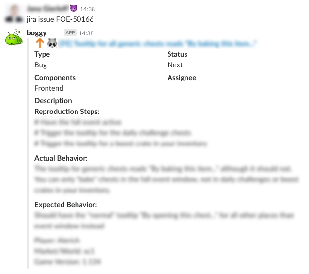
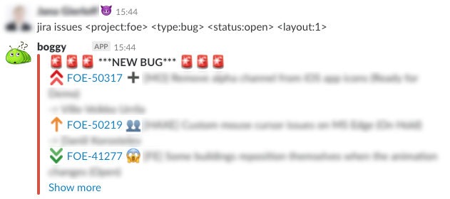
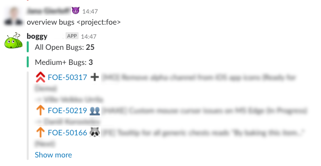

# Boggy
[](https://travis-ci.com/tigerteufel85/boggy)
[](https://godoc.org/github.com/innogames/boggy)
[](https://goreportcard.com/report/github.com/tigerteufel85/boggy)
[](https://github.com/tigerteufel85/boggy/releases)
[](https://opensource.org/licenses/MIT)
[](https://hub.docker.com/repository/docker/tigerteufel/boggy)

Boggy is a slack bot primarily meant to improve the workflow of QA in development teams, with focus on JIRA integration.


# Installation
**Quick steps:** (just use the bot via Docker)
- install Docker incl. docker-compose
- clone this repo or at least fetch the docker-compose.yaml
- create a config.yaml under config following the config.example.yaml
- `docker-compose up`

**Advanced** (when planning working on the bot core)
- install go (at least 1.11)
- clone/fork this repo
- create a config.yaml under config following the config.example.yaml
- `make run`

# Usage
As slack user, you just have to send a private message to the boggy user/app containing the command to execute.

Additionally you can execute commands in channels by prefix your command with @boggy, e.g. `@boggy jira issue project-123456`

*Note:* You have to invite boggy into the channel to be able to handle commands.

# Commands
## Help
The `help` command prints a list of all available commands of this bot.
With `help *command*` you'll get a short description and some examples of the given command.

## JIRA Issue
Query information from Jira for single ticket.

*Examples*
- `jira issue TEST-1234`



## JIRA Issues
Query information from Jira for or a whole list of tickets.

*Examples*
- `jira issues <project:TEST> <type:bug> <status:open>`
- `jira issues <project:TEST> <type:bug> <prio>blocker,critical</prio> <status:created> <time:1h>`
- `jira issues <project:TEST> <type:bug> <status:closed> <time:1h>`
- `jira issues <project:TEST> <type:bug> <assignee:test.user> <time:1d>`
- `jira issues <project:TEST> <jql>issuetype = bug AND created >=-100m</jql>`



### Parameters

#### `<project:test>`
- mandatory parameter which cannot be left out
- takes the project key as value
- only projects defined in the config.yaml under jira->projects are allowed

#### `<type:technical enhancement>`
- filters tickets by issue type
- can be any type used in the jira project

#### `<status:open>`
- filters tickets by the specified status
- statuses can be defined in the config.yaml under jira->statuses

#### `<prio>blocker,none</prio>`
- filters tickets by the specified priorities which are listed separated by comma
- allowed priorities are defined in the config.yaml under jira->priorities

#### `<sort:version>`
- sorts the result by the specified sorting
- the sortings can be specified in the config.yaml under jira->sorting

#### `<option:created>` + `<time:10m>`
- filters tickets which have been created/resolved within the last 10 minutes
- both parameters are mandatory for this to work
- option can be:
    - created
    - resolved
- time is a combination of a digit plus (m)inute, (d)ay, (h)our, (w)eek e.g.:
    - 10m
    - 1d
    - 24h
    - 2w

#### `<assignee:tigerteufel>` + `<time:10m>`
- filters tickets which have been assigned within the last 10 minutes
- both parameters are required for this to work
- assignee name needs to be the name as used in jira
- time is a combination of a digit plus (m)inute, (d)ay, (h)our, (w)eek e.g.:
    - 10m
    - 1d
    - 24h
    - 2w
    
#### `<jql>issuetype = bug AND created >=-100m</jql>`
- filters by a JQL query, please do not add any ordering to it
- please use with care as it makes the commands flexible but also more error prone

## JIRA Single
Query information from Jira and posts each issue one by one.

### Parameters
Generally the same parameters as for "JIRA Issues" can be used but there are a few additional ones.

#### `<offset-field:Start Time>` + `<offset-time:1h>` + `<time:10m>`
- queries tickets where the time from the Start Time field starts in 1h and lasts for 10m
- if current time is 2022-01-01 10:00 and with an offset of 1h and time of 10m
- it creates a query like `"Start Time" >= "2022-01-01 11:00" AND "Start Time" <= "2022-01-01 11:10"`

## Bugs Overview
Creates an overview of the current bug status of a project.

*Examples*
- `overview bugs <project:TEST>`



## Scheduling
Possibility to add, list and delete schedules. For adding a schedule a cron expression and the command needs tp be specified.

It is possible to schedule `jira issues` as well as `overview bugs` commands.

Schedules are best when used in combination with clever commands such as every 10 minutes report any newly created bug tickets.

*Examples*
- `schedule list`
- `schedule delete 1535644787286904783`
- `schedule add <cron:0/10 * * * *> <command>jira issues <project:test> <assignee:tigerteufel> <time:10m> <layout:7></command>`
- `schedule add <cron:0/10 * * * *> <command>jira issues <project:test> <type:bug> <option:created> <time:10m></command>`


# Installation
1. install Docker incl. docker-compose
2. Make sure Go version 1.11+ is installed
3. Clone the project
4. Create a config folder and following configs if not existing
    * config.yaml
    * schedule.list
    * user.list

#### Run without docker
This command will start the bot, using the `config.yaml`
```
make run
```

#### Run with docker
**Attention**: Create a config.yaml file first
```
make docker-run
```

#### Run via docker-compose
```
make docker-build
docker-compose up -d
```

# Configuration
The configuration is managed via a simple yaml file, see also config.example.yaml for reference.

## Slack
To run this bot, you need a "bot token" for your slack application. 
[Take a look here](https://api.slack.com/docs/token-types#bot) how to get one.

For the full boggy experience you should name the bot `boggy`

```
slack:
  token: xoxb-testing
```

## JIRA
First of all a JIRA connection needs to be established and all JIRA projects boggy shall have access too.
The JIRA user itself needs to be able to access the same projects via JIRA permissions.

```
jira:
  host: https://jira.example.de/
  username: boggy
  password: "testing"
  projects:
    - ABC
    - DEF
```

## Replies
This part of the configurations allows to create custom reply layouts for any JIRA queries.
Some are neeeded by default as they are used by commands. The color value `all` and `medium` relates to the bug thresholds which are set separately.
```
replies:
  jira:
    default:
      title: "I found %d issues:"
      text: list
      parameter: amount
      color: e8e8e8
      optionalfields: false
    overviewall:
      title:
      text: "All Open Bugs: *%d*"
      parameter: amount
      color: all
      optionalfields: false
    overviewmedium:
      title:
      text: "Medium+ Bugs: *%d*"
      parameter: amount
      color: medium
      optionalfields: false
    overviewlist:
      title:
      text: list
      parameter:
      color:
      optionalfields: true
```

Other layouts can be added as wished. They can use slack emojis as well as hex colors.

The parameter can either be left empty, amount or assignee.
- If set to `amount` the title or text should contain `%d` to be replaced with the actual amount of found issues.
- If set to `assignee` the title or text should contain `%s` to be replaced with the assignee name.

The optional field is a boolean and determines which information is shown for each JIRA issue.
- `true` adds status and assignee information if existent
- `false` adds components information if existent
```
replies:
  jira:
    1:
      title: ":rotating_light::rotating_light::rotating_light: ***NEW BUG*** :rotating_light::rotating_light::rotating_light:"
      text: list
      parameter:
      color: danger
      optionalfields: true
    2:
      title: ":beetle::bug::bee: New Issues :beetle::bug::bee:"
      text: list
      parameter:
      color: warning
      optionalfields: true
```

The bug thresholds are used by the overview command and reply layouts and changes the color of the reply based on the amount of found issues.
```
replies:
  bugthresholds:
    all:
      danger: 75
      warning: 50
    medium:
      danger: 25
      warning: 20
```

The following colors are used for replies in the commands and need to be defined.
```
replies:
  colors:
    red: "d04437"
    yellow: "ffa500"
    green: "good"
    blue: "0000cc"
    grey: "e8e8e8"
```